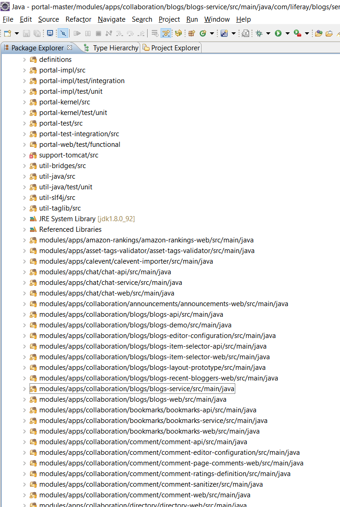

# Generate modules classpath

This script adds to liferay eclipse project all `src` directories from osgi modules 

## Installation
Just copy the sh files to your system

You can also add following line to your system aliases:

   * `alias generate_modules_classpath='curl https://raw.githubusercontent.com/jorgediaz-lr/generate-modules-classpath/master/generate_modules_classpath.sh | sh'`

(thanks to Cleydyr de Albuquerque for this idea)

For windows users: you can launch the script using git bash, [cygwin](https://www.cygwin.com/) or [mingw](http://www.mingw.org/)

## Usage
1. Important: Before using the script, execute `ant all` in order to download all `jar` dependencies
2. Execute `/path/generate_modules_classpath.sh [project-directory]`
   * project-directory: directory where eclipse project is located. (optional parameter, the current directory by default)
3. You can also use the "curl" approach explained above:
   * execute previous defined alias: `generate_modules_classpath`
   * or execute full command: `curl https://raw.githubusercontent.com/jorgediaz-lr/generate-modules-classpath/master/generate_modules_classpath.sh | sh`
4. The script will make a backup of original eclipse `.classpath` in `.classpath_backup` and `.classpath` will be populated with all src and jar files from osgi modules
5. Open eclipse and execute a refresh+clean of the project

In case you also want to add tests classes to classpath, use `generate_modules_classpath_with_tests.sh`
 
## Result
You will see all src modules and you will be able to find any liferay class from modules

